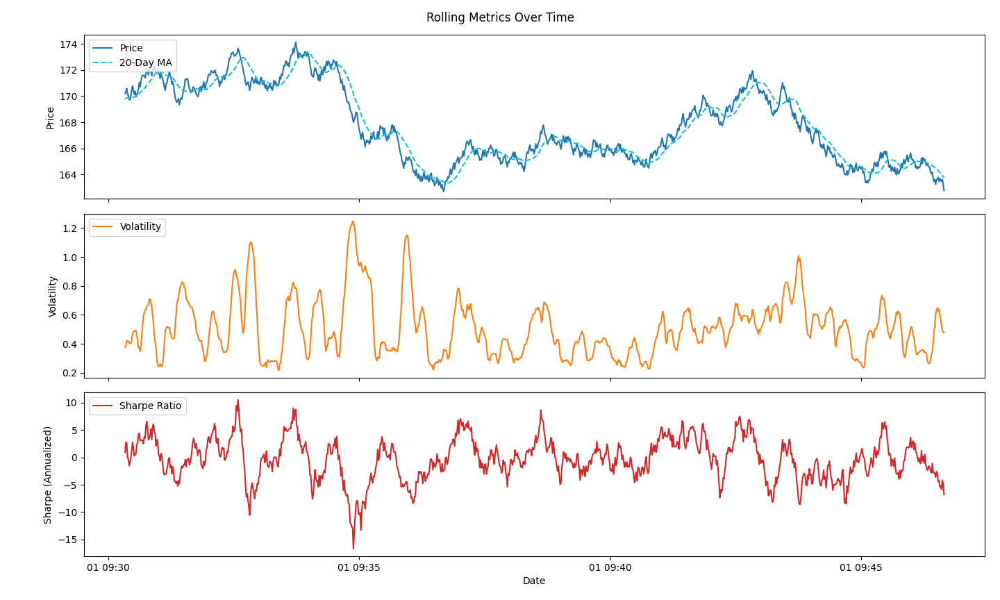
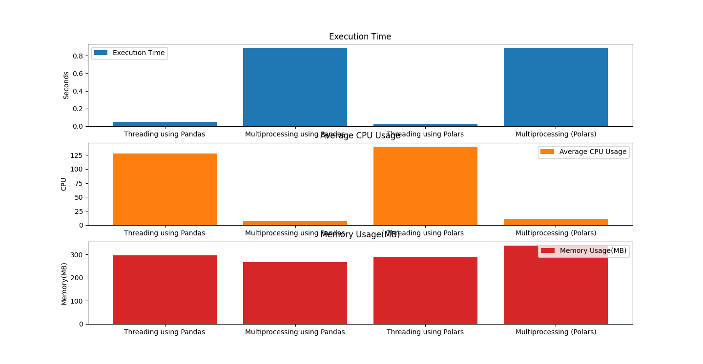

# Performance Report: Rolling Metrics Parallel Computation

This report summarizes the performance of rolling metrics computation across three symbols(AAPL, MSFT, SPY) using **Pandas** and **Polars**, with both **Threading** and **Multiprocessing** approaches. The goal is to compare **execution time** and **CPU utilization** for different window sizes.


To measure CPU utilization during the execution of the rolling metrics computations, we sampled the CPU usage of the process at 0.5-second intervals using psutil. These periodic readings were then **averaged** to obtain the mean CPU usage over the duration of each computation. This method provides an approximate view of the CPU load while the parallel tasks were running.


--- 

## Statistical Rolling Metrics


---

## Ingestion Time
| Library | Ingestion Time (s) | Mem Usage(MiB) |
|---------|-----------------|-----------|
| Pandas  | 0.139           | 216.71    |
| Polars  | 0.049           | 264.67    |

## Rolling Metrics Execution Time (Elapsed)
| Library | Symbol | Window | Sample Size | Execution Time (s) |
|---------|--------|--------|-------------|------------------|
| Pandas  | AAPL   | 20     | 1000        | 0.0327           |
| Polars  | AAPL   | 20     | 1000        | 0.0196           |

**Observations:**
- Polars outperforms Pandas in Ingestion time by leveraging more memory on the runtime.


## Performance Metrics
---




### 1. Window Size: 20

| Library | Method           | Time (s) | Avg CPU (%) |
|---------|-----------------|-----------|-------------|
| Pandas  | Threading        | 0.06      | 69.75        |
| Pandas  | Multiprocessing  | 0.92      | 6.19         |
| Polars  | Threading        | 0.02      | 142.0       |
| Polars  | Multiprocessing  | 0.94      | 10.27         |


**Observations:**

- Threading is extremely fast for small window sizes.
- Polars shows significantly higher CPU utilization with threading, suggesting it is more parallel internally.
- Multiprocessing overhead dominates for small data chunks, leading to longer times and low CPU usage.

---

### 2. Window Size: 1000

| Library | Method           | Time (s) | Avg CPU (%) |
|---------|-----------------|-----------|-------------|
| Pandas  | Threading        | 0.06      | 68.55       |
| Pandas  | Multiprocessing  | 2.38      | 2.74         |
| Polars  | Threading        | 0.02      | 138.5       |
| Polars  | Multiprocessing  | 2.35      | 4.3         |

**Observations:**

- Increasing the window size barely affects threading times due to efficient vectorized operations.
- Threading CPU usage stays high with Polars, showing strong internal parallelism.
- Multiprocessing still suffers from overhead; for small-to-medium workloads, threading is more efficient.

---

### 3. Summary

- **Threading** outperforms multiprocessing for small-to-medium data chunks, especially with Polars.
- **Multiprocessing** introduces overhead that is only worth it for very large datasets or CPU-bound computations where GIL is limiting.
- Polars demonstrates stronger CPU utilization and faster execution than Pandas for the same tasks.
- Due to Python's Global Interpreter Lock (GIL), multithreading has limited parallel performance for CPU-bound tasks; if the dataset is very large, multiprocessing is preferred for computationally intensive operations.
- For the dataset and window size tested, execution time was dominated by Threading, with Multiprocessing showing slower performance due to process creation overhead. This highlights that parallel execution speed gains are only realized for larger datasets or heavier computations
---

## Syntax difference: Pandas vs Polars
### 1. Imports and Dataframe creation
```python
# Pandas
import pandas as pd
df = pd.DataFrame({"a": [1, 2, 3], "b": [4, 5, 6]})

# Polars
import polars as pl
df = pl.DataFrame({"a": [1, 2, 3], "b": [4, 5, 6]})
```
> They are similar in importing and making dataframes.

### 2. Updating columns/Data Manipulation
```python
# Pandas
df_symbol[f"{col}_rets_mean_{window}"] = (
    df_symbol[f"{col}_rets"].rolling(window=window).mean()
)

# Polars
df_symbol = df_symbol.with_columns([
    pl.col(col).pct_change().rolling_mean(window_size=window).alias(f"{col}_rets_mean_{window}")
])

```
> Pandas has a more eager approach in data manipulation whereas Polars has a lazy approach. 
> Polars has a unique way of creating columns with 'with_columns'

### 3. Index
```python
#Pandas
df = pd.read_csv(file_path, index_col='timestamp', parse_dates=True)

#Polars
df = (
    pl.read_csv(file_path, has_header=True, try_parse_dates=True)
      .sort("timestamp")
      .with_columns(pl.col("timestamp").alias("_index"))
)
```
> Polars does NOT have index functionality so we add manually as above.


